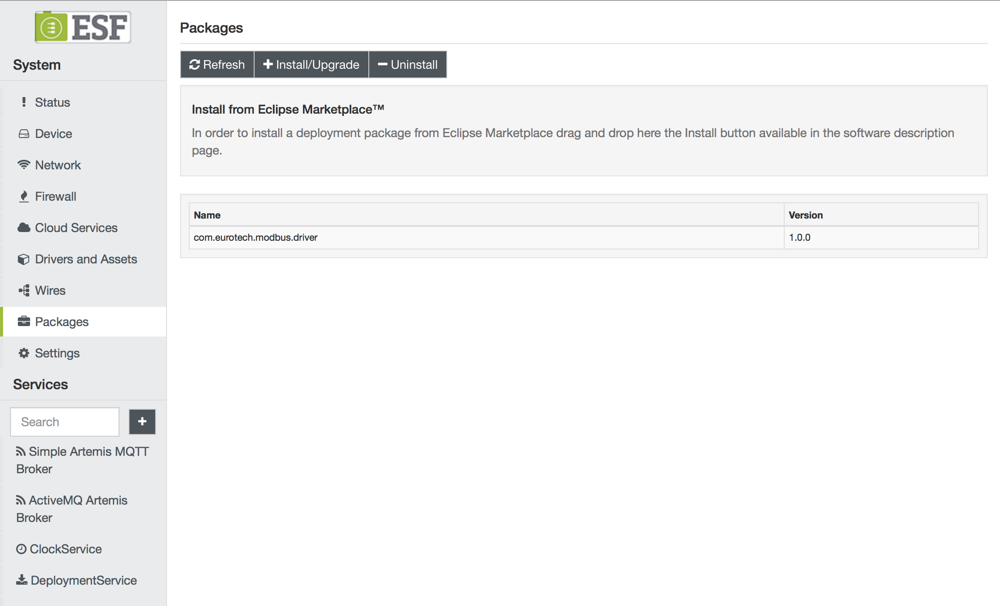
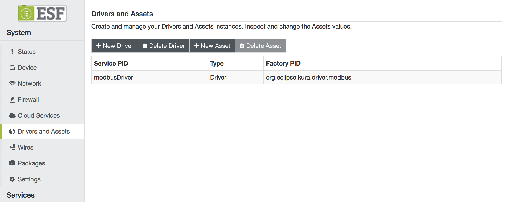
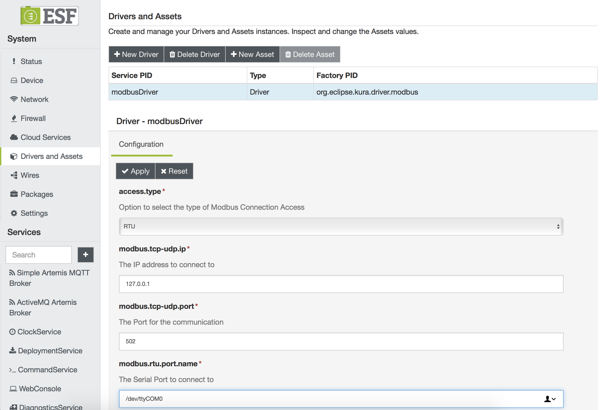
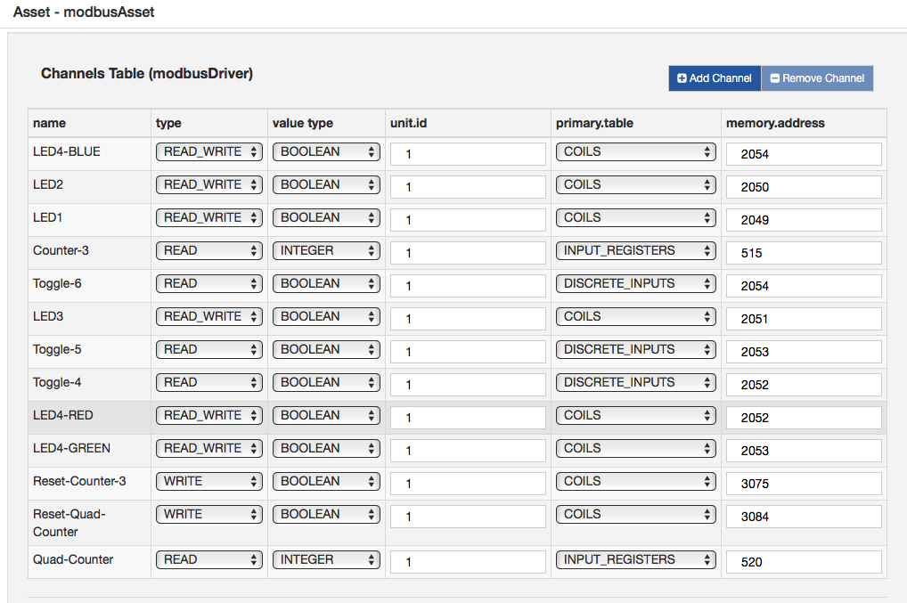
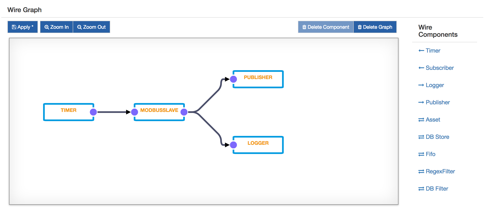

# EDC DevKit 4001
## Gateway Configuration
The Gateway configuration requires the following steps:
1. Install the latest version of ESF. You can download it from [here](http://www.eurotech.com/download/en/pb.aspx?pg=ESF)
2. Install the Eurotech Modbus Driver. It is available at the following [link](https://marketplace.eclipse.org/content/esf-modbus-driver). 
When installed, the ESF local Configuration UI should look like this:

3. In the ESF Administrative Web UI, create a new driver instance:
    - Under **Drivers and Assets**, click the **New Driver** button
    - Select **org.eclipse.kura.driver.modbus**, type in a name, and click **Apply**: a new service will show up in the **Drivers and Assets** table.
   A new Driver instance will appear:
   
4. Configure the new service as follows:
    - **access.type**: RTU
    - **modbus.rtu.port.name**: The Serial Port to connect to. Usually set to **/dev/ttyCOM0**
    
5. Click on **Wires** in **System**
6. Add a new **Timer** component and configure the interval at which the Modbus slave will be sampled
7. Add a new **Asset** with the previously added Modbus driver
8. Configure the new Modbus asset, adding the following channels:
   
9. Add a new **Publisher** component and configure the chosen cloud platform stack in **cloud.service.pid** option
10. Add a **Logger** component
11. Connect the **Timer** to the **Asset**, and the **Asset** to the **Publisher** and **Logger**.
12. Click on **Apply** and check the logs and cloud platform that the data is correctly published.
    

## Hosted Dashboard
https://devkit-wires.everyware-cloud.com